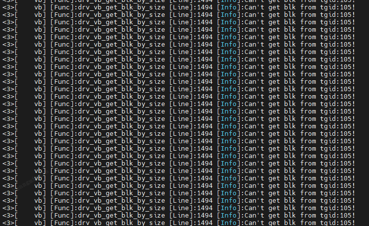

## 问题现象

logmpp 提示获取不到 VB，但没有明确是哪个模块获取不到。



## 可能原因

VENC 编码优先级不够高，一直被前级抢占资源。

### 解决方案

提高 venc 最大码流的优先级：

```c
ret = xmedia_venc_get_chn_param(venc_chnhdl, &mpi_chn_param);
MEDIA_RETURN_IF_FAIL(ret, XMEDIA_FAILURE);

mpi_chn_param.priority = 1;

ret = xmedia_venc_set_chn_param(venc_chnhdl, &mpi_chn_param);
MEDIA_RETURN_IF_FAIL(ret, XMEDIA_FAILURE);
```
