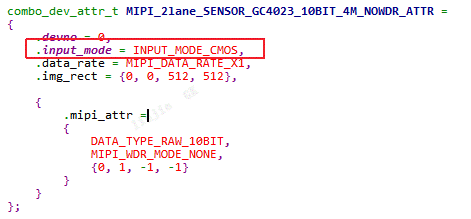
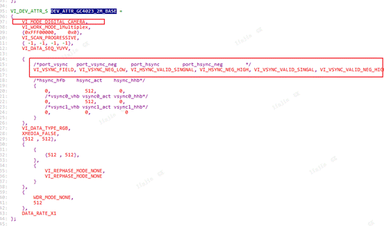
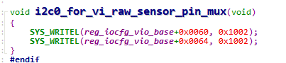
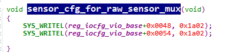
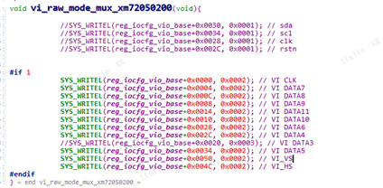
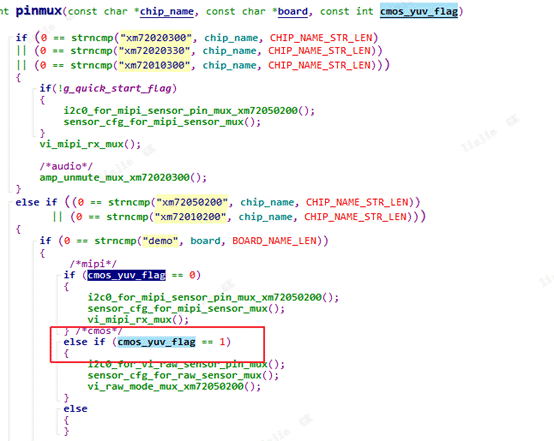

# DVP Sensor 适配

## 环境

- 主板：7205V500
- Sensor：GC4103（示例）
- SDK：030

## Sensor 适配

如果使用的 sensor 从未适配过，需要先适配 sensor 驱动，并确认 sensor 支持 DVP 输出。以 GC4103 为例，sample 中没有适配，需要新增驱动。

Sensor 适配详见《sensor_sample适配方法.pdf》。

### 1. 修改 SAMPLE_COMM_VI_GetComboAttrBySns

修改对应 sensor 的 input mode，DVP 需要改为 `INPUT_MODE_CMOS`。

### 2. 修改 SAMPLE_COMM_VI_GetDevAttrBySns 参数

设置为 `VI_MODE_DIGITAL_CAMERA`。

## 引脚复用

开发板从 MIPI 输出改为 DVP 输出，需要修改对应 I2C、sensor、VI 引脚复用。以 7205V500 主板 + GC4103 sensor 为例，复用请以实际硬件为准。

修改代码位置：`source/gmp/modules/sysconfig/sys_config.c`

### 1. I2C 引脚复用修改

### 2. Sensor 引脚复用修改

### 3. VI 相关引脚复用

### 4. load 参数修改

在串口加载驱动时，修改 load 参数：`./load xm72050200 -i -sensor gc4023 -osmem 32 -board demo -yuv0 1`，其中 `-yuv0` 为 1 时才是 DVP 输出。

## FAQ

### 1. 初始化 sensor 报错 I2C 写入错误

- 确认管脚复用是否配置正确。
- 确认硬件是否 OK。以 V500 主板为例，需要硬件上修改才能复用管脚。

### 2. VPSS 输出帧率与预期不符

- 调整 sensor 时钟。
