# Sensor Sample 适配笔记

适配新 sensor 的大体原则：选择一款同一厂商、规格相近的 sensor 驱动来做修改，先保证软件编译通路 OK，再保证硬件通路 OK，最后再调试效果。

以 gk7605v100 上适配 imx290（2M 30fps）为例，以 imx307（2M 30fps）驱动为参考，因为两者的分辨率、帧率、设备地址、地址位宽、数据位宽都一样。

## 1. 确认主芯片规格

确认主芯片规格的目的，是看将要适配的 sensor 的初始化时序能否跑起来。例如 gk7205v200 不支持行 WDR，分辨率最大只能 3M，具体情况视主芯片规格而定。适配 sensor 主要关注以下几点：

- 支持输入频率上限（一般都会支持，不是重点）。
- 主芯片目前都是 master 模式（slave 模式主要用于拼接，暂时没有）。
- 支持最大分辨率和帧率的组合，如线性 5M 30fps（imx335）。
- 支持线性、帧 WDR、行 WDR（gk7205v200、gk7202v300 不支持）。
- MIPI CSI-2 lane 数：gk7605v100 为 4 lane，gk7205v200 为 2 lane；LVDS 暂时不涉及。

## 2. Sensor 驱动

写驱动之前要准备好 sensor 初始化序列，一般由厂商提供，需和厂商确认以下几点：

- sensor 工作在主模式下，从模式暂时不涉及。
- sensor 的时钟频率为 37.125MHz。
- sensor 通过 I2C 读写。
- sensor 通过 MIPI CSI-2 传输数据，lane 数为 4。
- 线性、分辨率 2M、帧率 30fps、RAW12，ADBIT 为 12bit。

在 `sensor/gk7205v200` 目录下新建一个文件夹，为了保持风格一致取名为 `sony_imx290`，并在当前目录下的 Makefile 中添加 `objects += sony_imx290`。

进入 `sony_imx290` 文件夹，新建以下四个文件，内容从 `sony_imx307` 拷贝过来：

```
├── imx290_cmos.c         // ae、awb、blc、isp_default、sns_reg，功能调试时再做修改
├── imx290_cmos_ex.h      // 算法参数，编译 sample 时会做稍微修改
├── imx290_sensor_ctl.c   // 初始化序列
└── Makefile              // 编译脚本
```

## 3. 编译 Sensor 库

编译 sensor 的目的是保证 sensor 驱动总体框架是 OK 的，后面会根据 sample 下的编译适当做些修改，具体情况看编译报错信息。

在 `sony_imx290` 目录下单独编译 sensor 库，编译之前先对驱动做以下几处修改：

- Makefile 中将 `libsns_imx307` 改为 `libsns_imx290`。
- `ctl.c` 中，把 imx307 线性 1080p30fps 的初始化序列替换成 imx290 的初始化序列。
- 其余修改可用全局替换，把 307 替换成 290。

> 注：SHS1、GAIN、VMAX、HCG、HMAX 这几个寄存器地址相同，未做修改；SHS2、RHS1、RHS2、Y_OUT_SIZE 这几个寄存器是 WDR 时需要配置的，后面适配 WDR 模式再做介绍，寄存器地址参考 datasheet。

`cmos.c` 里面的相关功能函数暂时不做修改，后面调试基本功能和图像质量的时候再讲解。

## 4. Sample 下 Sensor 的基本通路

sensor 基本通路的适配是指从 sensor 到 ISP 的通路能够起来，暂且先不管图像效果，主要涉及 mipi、dev、pipe、chn、isp_pub 属性的适配等，相关属性可参考 imx307。

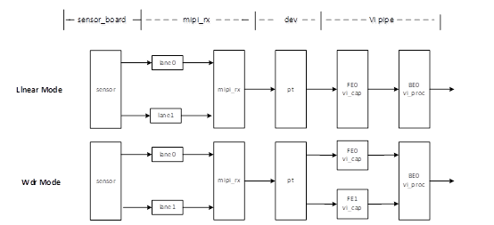

经过以上 3 步，在 `out/lib` 目录下会有 imx290 的动态库和静态库生成，现在主要是在已有的 sample 框架下适配 imx290 的 mipi → vi → isp 软件通路：

- **设置 mipi 属性**：在函数 `SAMPLE_COMM_VI_GetComboAttrBySns` 中实现 imx290 的 `combo_dev_attr_t`，可参考 imx307 的 mipi 属性。devno、lane_id 不匹配的话，后期 mipi 没有数据出来。

  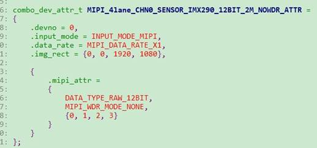

  

- **设置 dev 属性**：在函数 `SAMPLE_COMM_VI_GetDevAttrBySns` 中实现 imx290 的 `VI_DEV_ATTR_S`。

  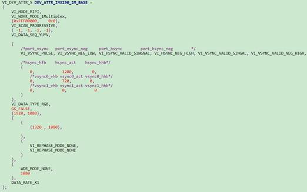

  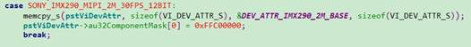

- **设置 pipe 属性**：在函数 `SAMPLE_COMM_VI_GetPipeAttrBySns` 中实现 imx290 的 `VI_PIPE_ATTR_S`。

  

- **设置 chn 属性**：在函数 `SAMPLE_COMM_VI_GetChnAttrBySns` 中实现 imx290 的 `VI_CHN_ATTR_S`。

  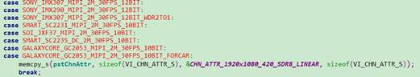

- **设置 isp_pub 属性**：在函数 `SAMPLE_COMM_ISP_GetIspAttrBySns` 中实现 imx290 的 `ISP_PUB_ATTR_S`。

  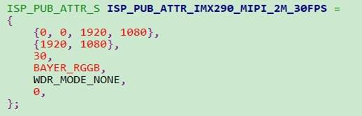

  

- **注册 sensor 对象**：在函数 `SAMPLE_COMM_ISP_GetSnsObj` 中增加 imx290，并在 `sns_ctrt.h` 中添加 `extern ISP_SNS_OBJ_S stSnsImx290Obj;`。

  

- **验证通路**：执行 `./sample_vio 0`（`./sample_vio -h` 查看用例）。如有信息打印出来，且在 `sample/vio` 目录下有码流生成，说明基本通路整体 OK，可进一步通过查看 proc 信息验证；如果没有码流生成，也可通过 proc 信息、I2C 读写手段排除引起错误的原因。

  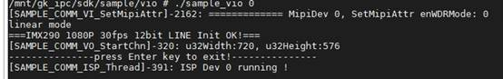

## 5. ISP 基本功能

ISP 基本功能主要涉及以下函数：`cmos_set_image_mode`、`cmos_set_wdr_mode`、`cmos_get_isp_default`、`cmos_get_isp_black_level`、`cmos_set_pixel_detect`。

- **`cmos_set_image_mode`**：根据 `enWDRMode` 和分辨率设置 `u8SensorImageMode`、`u32FLStd`、`u8Hcg`、`u32BRL` 等变量的值，其中：
  - `u8SensorImageMode`：表示线性、行 WDR、帧 WDR。
  - `u32FLStd`：基准帧率下一帧的总行数，即 VMAX 寄存器中的值。根据 datasheet 可查，线性或帧 WDR 时为 `0x465`，行 WDR 10bit 时为 `0x4c4 * 2`。
  - `u8Hcg`：帧率选择和增益选择。低两位表示帧率（1h:60fps、2h:30fps），第 4 位表示增益选择（0:LCG、1:HCG），一般默认为 0，但当 again 超出一定范围时设为 1。
  - `u32BRL`：读出时间，一般行 WDR 时赋值为 1109，datasheet 可查。
- **`cmos_set_wdr_mode`**：主要用于区分不同的 WDR 模式（线性、行 WDR、帧 WDR 等），AE 会根据不同模式进行对应的参数修改。
- **`cmos_get_isp_default`**：配置 ISP 算法的基本校正参数，后期图像质量调优时可以去修改。
- **`cmos_get_isp_black_level`**：配置 RAW 数据四个通道的黑电平，datasheet 上可查。有些 sensor 的黑电平会随 gain 值变化而漂移，需要在不同范围的 gain 值下给出不同的黑电平值。
- **`cmos_set_pixel_detect`**：像素校正模式时使用，不支持行 WDR。

## 6. AE 配置

AE 主要功能是动态调节 sensor 的曝光时间和增益来获取最佳图像质量，也是整个 `cmos.c` 的核心，主要涉及以下函数：`cmos_get_sns_regs_info`、`cmos_get_ae_default`、`cmos_again_calc_table`、`cmos_dgain_calc_table`、`cmos_get_inttime_max`、`cmos_gains_update`、`cmos_inttime_update`、`cmos_fps_set`、`cmos_slow_framerate_set`。

- **`cmos_get_sns_regs_info`**：把 sensor 曝光时间、增益相关的寄存器地址赋值给 AE 模块，同时为避免生效不同步，引入 `u8DelayFrmNum` 参数，保证增益、曝光时间、isp_dgain 同时生效。
- **`cmos_get_ae_default`**：初步获取 AE 的默认参数，主要涉及曝光时间精度类型、again 精度类型、dgain 精度类型、ISP 数字增益、最大最小 again/dgain、曝光策略、初始化曝光时间等。如果是 WDR 模式，还需要配置曝光比，各个参数具体含义可参考《isp开发参考》。
- **`cmos_Xgain_calc_table`**：计算出当前 sensor 的增益值。查看 datasheet 可知计算增益的方式是线性关系还是查表关系，需与 `cmos_get_ae_default` 中的 gain 精度类型对应。datasheet 一般都会提供计算增益的方式，目前 sony 采用的都是查表方式，以 0.3dB 方式递增，表中的第一个值 1024 表示最小增益。
- **`cmos_gain_update`**：根据输入的 again、dgain 配置 sensor 的 gain 寄存器，当 again 大于一定数值时，会打开 HCG_MODE。
- **`cmos_get_inttime_max`**：只在 xto1 WDR 行模式下有效，用于计算不同曝光比下曝光时间的最大值，曝光时间限制为长曝光时间加短曝光时间的和要小于一帧长度。
- **`cmos_inttime_update`**：用于更新 sensor 的曝光时间。xto1 WDR 模式时会被调用 X 次，第一次传入短帧的曝光时间。
- **`cmos_fps_set`**：手动设置 sensor 的帧率，根据设置的帧率重新计算 VMAX、曝光时间等。需要注意的是帧率最大值一般为 30fps，最小值理论上可以非常小，但实际应用中最小 5fps（需要后期调试得到经验值）。
- **`cmos_slow_framerate_set`**：AE 自动降帧配置函数，根据当前曝光实际需要的行数配置 sensor 的 VMAX 寄存器，并返回实际生效行数 `u32FullLines`。

## 7. PQ 下 Sensor 的基本配置

主要是为了实时看码流和在线调试。

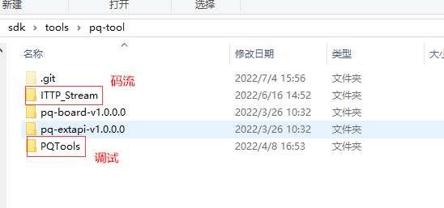

### config 目录下 .ini 的适配

基于规格相近的 sensor 修改。

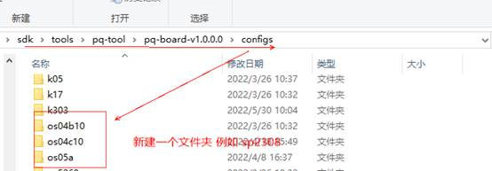

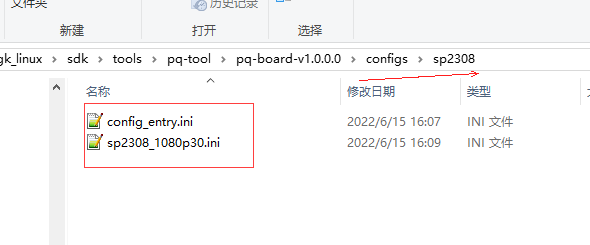

### libs 目录

放置 `.so` 文件。

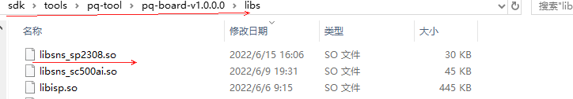

### 网络与调试环境准备

```
ifconfig eth0 down
ifconfig eth0 hw ether xx:xx:xx:xx:xx:xx
ifconfig eth0 xxx.xxx.xxx.xxx netmask 255.255.255.0
route add default gw xxx.xxx.xxx.xxx
telnetd &
```

```
mount -t nfs -o nolock -o tcp 192.168.146.200:/home/xxx /mnt
cd /mnt/gk_linux/sdk/out/gk7205v300/ko
./loadgk7605v100 -i -sensor sp2308 -osmem 32M -board demo -yuv0 0
cd /mnt/gk_linux/sdk/tools/pq-tool/pq-board-v1.0.0.0/
./IspTool.sh -a sp2308 0
```

### 查看码流

正常情况业务已经跑起来，可以打开码流工具，连上 IP 实时看码流。

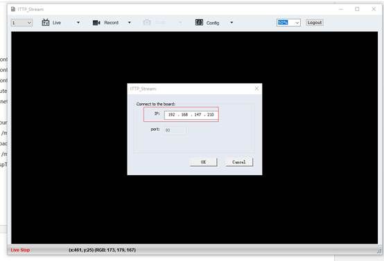

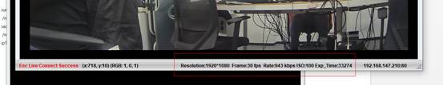

### 在线调试

需要调试的话，打开调试工具。

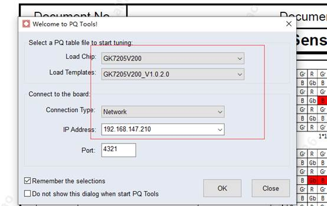

“1”处出报错不用管，点“2”、点“3”、点 connect 即可，后面会有 `Connected to [192.168.147.210(4321)] successfully`。

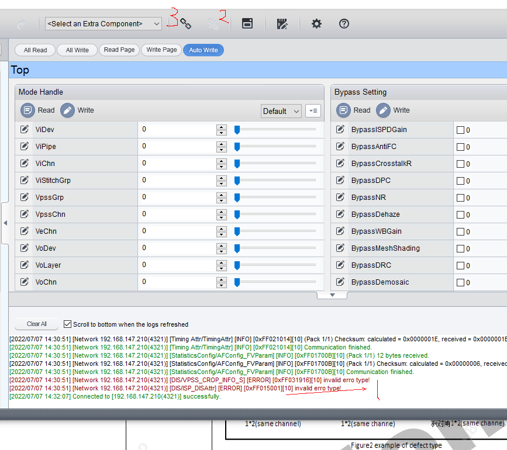
